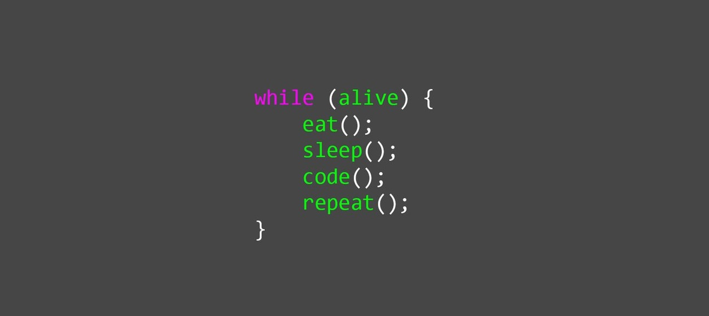

<h2>  Hi, my name is Nikita and I'm a Fullstack Developer from Ukraine &nbsp; </h2>

    

---

<h3>About me:</h3>

- 🌱 I have completed the frontend courses in <a href="https://edu.cbsystematics.com/ru">CyberBionicSystematics</a>.
- 🔭 In my spare time, I work on my pet-projects and study new trends technologies.
- ⚡ Currently I work as a Fullstack developer at the IT company <a href="https://spekter.site/">"Spekter"</a>.
<!-- - 📫 How to reach me:   -->
  

---

<h3>My skils:</h3>

<!--  -->

---

<h3>🔥 My stats:</h3>

&nbsp;&nbsp;&nbsp;&nbsp;